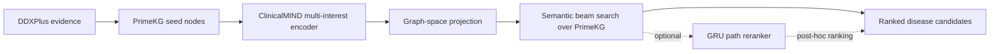

# MedMIG-CR

**Graph-grounded multi-interest retrieval for differential diagnosis**

MedMIG-CR studies how to retrieve plausible disease concepts for a patient case by connecting mapped clinical evidence to a large biomedical knowledge graph. The project combines DDXPlus clinical cases, PrimeKG graph structure and node representations, a contrastively aligned MIND query encoder, semantic beam search, and an optional path-level GRU reranker.

> **Research question.** Can a query encoder learn one or more graph-space clinical interests that guide knowledge-graph search toward the patient's target diagnosis, and can relation-aware path reranking improve the order of the retrieved candidates?

## Overview

Given a case's observed evidence, the system maps evidence mentions to PrimeKG seed nodes. ClinicalMIND encodes the seed sequence into `K` interest vectors and projects them into the frozen PrimeKG node2vec space. Semantic beam search expands paths from the seed nodes in both graph directions. A path scorer can optionally rerank the completed candidates using relation, direction, node-type, and endpoint information.



The core comparison is between direct disease ranking and graph retrieval. Direct rankers can score the complete disease candidate set from learned query-target features; the proposed retrieval branch instead has to discover candidates through graph connectivity and rank the resulting paths.

## Dataset and Knowledge Graph

### DDXPlus

DDXPlus supplies patient cases, observed evidence, pathology labels, and differential diagnoses. This workspace's v2 query cohort contains 1,023,037 training queries, 132,190 validation queries, and 134,236 held-out test queries. Query records represent observed evidence as `seed_node_keys` and mapped targets as `target_node_keys`; target nodes are removed from seed evidence to prevent label leakage.

### PrimeKG

The processed graph contains 82,240 nodes and 2,734,346 directed edges across 18 relation types. Frozen 64-dimensional node2vec vectors provide graph-space representations for the contrastive encoder, beam scoring, and selected baseline models. The DDXPlus condition map resolves 49 pathology labels to 47 distinct PrimeKG target nodes; two label pairs collapse to shared ontology concepts. The open disease candidate list used by full-space rankers contains 22,205 disease nodes.

### Mapping and query construction

The v2 mapping work adds clinical aliases, token-indexed fuzzy matching, negative categorical-value filtering, and limited multi-mapping for evidence. Query construction retains broader evidence coverage, reports mapping statistics, and excludes target nodes from the seed set. The processed test cohort retains 134,236 of 134,529 source test patients; all 49 pathology labels are mapped, although some labels share a PrimeKG target concept.

## Method

### InfoNCE MIND

ClinicalMIND uses capsule-style Behavior-to-Interest dynamic routing to transform an ordered, padded sequence of evidence-node IDs into `K` latent interests. Each interest passes through a trainable projection and is normalized in the 64-dimensional PrimeKG graph space. `K=1` represents a single search direction; larger K allows multiple query-specific directions.

The main objective aligns predicted interests with graph embeddings of target nodes and observed evidence. For multi-interest models, a diversity penalty discourages duplicated directions:

```text
L = L_target-InfoNCE + 0.2 * L_evidence-InfoNCE + 0.05 * L_diversity
```

The current E10 model configuration uses embedding dimension 64, three routing iterations, maximum input length 32, and temperature 0.07. Training uses the full v2 train/validation query sets. The K=1 ablation removes the multi-interest capacity while retaining graph-space contrastive alignment.

### Semantic beam search

For each interest vector, the search expands incoming and outgoing neighbors from the mapped seed nodes. Each extension is scored using its cosine similarity to the interest vector with a degree penalty:

```text
step_score = alpha * cosine(neighbor_embedding, interest_vector)
             - beta * log(degree(neighbor) + 1)
path_score = sum(step_score over path extensions)
```

The current E10 retrieval setting uses 10 hops, beam width 128, up to 4,096 paths per interest, `alpha=1.0`, and `beta=0.1`. Candidate collection uses the fixed mapped target universe; per-query labels are used only by evaluation, not search.

### GRU path reranker

The optional reranker encodes each path as a sequence of hop tokens. A token combines a learned relation embedding (32-D), traversal-direction embedding (8-D), node-type embedding (8-D), and a projection of the frozen endpoint node embedding (64-D to 32-D). A one-layer GRU with 64 hidden units summarizes the path; an MLP maps the final state to a path score. It is trained with pairwise BPR using positive target paths and hard negative disease paths.

The reranker has two distinct modes: **post-hoc reranking**, which reorders candidates found by the ordinary beam, and **GRU-guided beam search**, which changes beam pruning. Results are labeled by mode; they should not be conflated.

## Evaluation

The primary ranking metrics are MRR and Recall@1/5/10/20/50. Unless stated otherwise, metrics are macro-averaged over evaluated queries, and queries without a prediction contribute zero. Candidate coverage is reported separately where available. Direct rankers score the complete disease candidate space; graph retrieval returns candidates reached by its search procedure, so candidate reachability and final ranking are separate factors.

## Results

### Main retrieval runs

The following results use the first 5,000 rows of the held-out DDXPlus v2 test-query file and the pathology target mode. The seed-only and E10 K=3 runs share this cohort and evaluator, but differ in encoder/reranker configuration.

| Method | Query representation | GRU mode | MRR | R@1 | R@5 | R@10 | R@20 | R@50 |
|---|---|---|---:|---:|---:|---:|---:|---:|
| Seed-only + beam | Mean seed embedding | None | 0.0843 | 0.0158 | 0.1484 | 0.2490 | 0.3738 | 0.4106 |
| InfoNCE MIND E10, K=3 | Three graph-space interests | Post-hoc reranker; no GRU beam guidance | **0.4738** | **0.4362** | **0.5250** | **0.5428** | **0.5442** | **0.5442** |

The K=3 result uses the checkpoint `ddxplus_infonce_e10_hop10/k3` and a GRU trained on K=3 paths. Its result directory is named `no_gru_guided`, meaning GRU guidance was disabled during beam pruning; post-hoc GRU reranking remained enabled. It is therefore **not** a no-GRU result.

### Baseline snapshot

Baselines below have different evaluation scopes and are shown as method-specific evidence, not as a single controlled leaderboard.

| Baseline | Evaluation scope | MRR | R@5 | R@10 | R@20 | R@50 |
|---|---|---:|---:|---:|---:|---:|
| Direct MLP, full PrimeKG disease space | Full test, 134,236 queries | 0.9087 | 0.9363 | 0.9370 | 0.9372 | 0.9374 |
| Direct XGBoost, profile | Validation, 2,000 queries; 5k train rows | 0.5669 | 0.9235 | 0.9415 | 0.9470 | 0.9490 |
| PPR, restart 0.20 | Validation, 2,000 queries | 0.0048 | 0.0055 | 0.0135 | 0.0165 | 0.0390 |
| R-GCN | Test subset, 5,000 queries; trained on up to 200k | 0.0558 | 0.0542 | 0.1030 | 0.1178 | 0.2696 |

**Interpretation of direct ranking.** MLP and XGBoost are supervised direct rankers over all 22,205 disease nodes. Their high scores are expected in part because they learn directly from query-target training pairs and do not depend on graph candidate reachability or path search. They are useful upper-reference systems for direct ranking, but are not mechanism-matched graph-retrieval baselines. The MLP's separate `full_v2` run uses only the 47 mapped targets as a closed candidate set and is excluded from the table.

**PPR status.** The reported PPR values are validation tuning results with a 50-iteration cap. None of the 2,000 queries converged at tolerance `1e-8`, so this is preliminary rather than a finalized PPR benchmark.


## Reproducing the Main Result

The commands below reproduce the K=3 InfoNCE + post-hoc GRU result on the first 5,000 held-out test queries. Run them from the repository root. They assume the processed DDXPlus query CSVs, PrimeKG graph artifacts, and v2 condition map are already available locally. Outputs are written under `experiments/reproduction/k3_gru_posthoc/`.

1. Train InfoNCE MIND with K=3 for 10 epochs:

```bash
.venv/bin/python src/medmigcr_mind/train_mind_infonce_ddxplus.py \
    --train_csv data/processed/ddxplus_v2/train_queries.csv \
    --valid_csv data/processed/ddxplus_v2/valid_queries.csv \
    --graph_dir data/processed/primekg_graph \
    --out_dir experiments/reproduction/k3_gru_posthoc/checkpoints/mind \
    --K 3 --epochs 10 --batch_size 128 --lr 1e-3 --weight_decay 1e-5 \
    --seed 42 --device cpu
```

2. Generate training paths from the first 100,000 training queries:

```bash
.venv/bin/python scripts/reranking/build_gru_path_reranker_dataset.py \
    --queries_csv data/processed/ddxplus_v2/train_queries.csv \
    --graph_dir data/processed/primekg_graph \
    --checkpoint experiments/reproduction/k3_gru_posthoc/checkpoints/mind/clinical_mind_infonce_k3.pt \
    --condition_map data/mappings/ddxplus_v2/condition_to_primekg.json \
    --output_jsonl experiments/reproduction/k3_gru_posthoc/data/k3_train_paths_100k.jsonl \
    --limit_patients 100000 --interest_count 3 \
    --max_hops 10 --beam_width 128 --paths_per_interest 4096 \
    --alpha 1.0 --beta 0.1 --device cpu --graph_device auto
```

3. Train the GRU reranker using the reported configuration:

```bash
.venv/bin/python scripts/reranking/train_gru_path_reranker.py \
    --train_jsonl experiments/reproduction/k3_gru_posthoc/data/k3_train_paths_100k.jsonl \
    --metadata_json experiments/reproduction/k3_gru_posthoc/data/k3_train_paths_100k.metadata.json \
    --graph_dir data/processed/primekg_graph \
    --out_checkpoint experiments/reproduction/k3_gru_posthoc/checkpoints/gru_k3.pt \
    --epochs 12 --steps_per_epoch 2000 --batch_size 256 \
    --hard_negative_top_k 32 --lr 1e-3 --weight_decay 1e-5 \
    --validation_fraction 0.1 --validation_pairs 2048 \
    --early_stopping_patience 2 --seed 13 --device cpu
```

4. Retrieve candidates with ordinary beam pruning and post-hoc GRU reranking:

```bash
.venv/bin/python scripts/retrieval/run_ddxplus_infonce_gru_rerank.py \
    --test_queries_csv data/processed/ddxplus_v2/test_queries.csv \
    --graph_dir data/processed/primekg_graph \
    --mind_checkpoint experiments/reproduction/k3_gru_posthoc/checkpoints/mind/clinical_mind_infonce_k3.pt \
    --reranker_checkpoint experiments/reproduction/k3_gru_posthoc/checkpoints/gru_k3.pt \
    --condition_map data/mappings/ddxplus_v2/condition_to_primekg.json \
    --output_csv experiments/reproduction/k3_gru_posthoc/results/test5000/predictions.csv \
    --summary_json experiments/reproduction/k3_gru_posthoc/results/test5000/retrieval_summary.json \
    --interest_count 3 --max_hops 10 --beam_width 128 --paths_per_interest 4096 \
    --top_k 50 --alpha 1.0 --beta 0.1 --limit_patients 5000 \
    --disable_gru_beam_guidance --device cpu --graph_device auto
```

`--disable_gru_beam_guidance` keeps GRU out of beam pruning; the loaded GRU still reranks completed paths.

5. Calculate metrics on the same 5,000-query cohort:

```bash
.venv/bin/python scripts/evaluation/evaluate_ddxplus_retrieval.py \
    --queries_csv data/processed/ddxplus_v2/test_queries.csv \
    --condition_map data/mappings/ddxplus_v2/condition_to_primekg.json \
    --predictions experiments/reproduction/k3_gru_posthoc/results/test5000/predictions.csv \
    --output_dir experiments/reproduction/k3_gru_posthoc/results/test5000/evaluation \
    --target_mode pathology --topk 1 5 10 20 50 --limit_patients 5000
```

The retrieval summary, metric summary, and per-query metrics are written alongside the predictions. Small differences from the reported values may occur across hardware or library versions.

## Reproducibility and artifacts

Generated datasets, checkpoints, predictions, and metric files are kept in the workspace and may be excluded from version control. Result folders contain prediction-level outputs and summaries; the experiment reports document additional setup and evaluation caveats.

| Resource | Location |
|---|---|
| DDXPlus-to-PrimeKG mapping and query construction study | [reports/mapping_query_v2_experiment.md](reports/mapping_query_v2_experiment.md) |
| InfoNCE K sweep, hop 6 | [reports/infonce_hop6_beam64_experiment.md](reports/infonce_hop6_beam64_experiment.md) |
| E6 beam and GRU reranking study | [reports/infonce_e6_hop8_gru_reranker_report.md](reports/infonce_e6_hop8_gru_reranker_report.md) |
| Baselines and weekly ablations | [report.md](report.md) |
| Official v2 train/validation/test query files | `data/processed/ddxplus_v2/` |
| PrimeKG graph and embeddings | `data/processed/primekg_graph/` |
| Ablation outputs | `experiments/ablations/` |
| Benchmark implementations | `Benchmark_baselines/` |

### Code map

| Component | Location |
|---|---|
| Graph storage, scoring, beam search, retrieval engine | `src/medmigcr_kg/` |
| ClinicalMIND and contrastive training | `src/medmigcr_mind/` |
| GRU path reranker | `src/medmigcr_path_reranker/` |
| Retrieval and evaluation entry points | `scripts/retrieval/`, `scripts/evaluation/` |
| Direct and graph baselines | `Benchmark_baselines/` |
